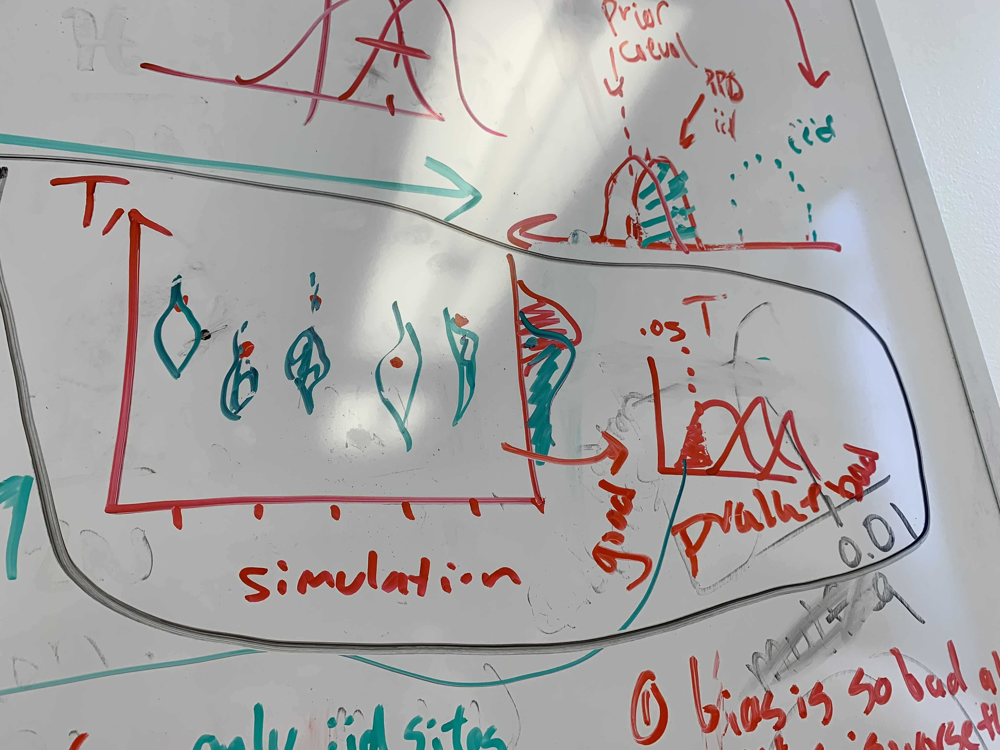
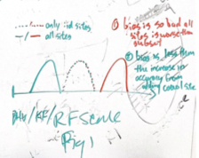

# phyload
phylogenetics: is it cool, or is it whack?

[ideas gdoc](https://docs.google.com/document/d/1HngpWktaFAsWj2LpsMAm95bWI35Z7xhHEFO_ypXjK8E/edit?usp=sharing)

[lit review gdoc](https://docs.google.com/document/d/12bUunPfAaGOtpo7A_7NplCRbuwR07rZ8wIZTdroUaH0/edit?usp=sharing)

## Outline

### 1. Perform simulations with the Nasrallah and Huelsenbeck model

- Simulate alignments with 800 iid sites or 800p iid sites and 800(1-p) coevolving sites   
- Can we define statistics to detect coevolution in the alignments?  
- Inference under iid model for the iid alignments and alignments with some number of coevolving sites   
- Posterior predictive check on trees

### (2.) Repeat step 1 with the Meyer *et al.*, 2019 model

*maybe*  

After we have the ball rolling with step #1 we might want to go do a small, spot check analysis using their website simulation setup

### 3. Prove this?

Look at the work of Amy Willis.

### 4. real data?
*maybe*

## Misc.
We outline two figures showing some expected results.

The first is showing what we might expect from the inference of step #1:  
   
We can simulate alignments under a model with coevolution.
For each simulated alignment, we can calculate some statistic T, fit a GTR to that alignment, simulate under the fit GTR and calculate a distribution of T on these GTR-simulated alignments.
If the statistic is good at picking up on coevolution, we would expect the pvalues to be small.
As decrease the number of coevolving sites, we expect the pvalues to get larger.

The second is showing the two hypotheses for the effect of coevolving sites on tree inference:  
  
Imagine you have sequences with some coevolving sites and some iid sites.
Should you use all the sites or just the iid sites?
