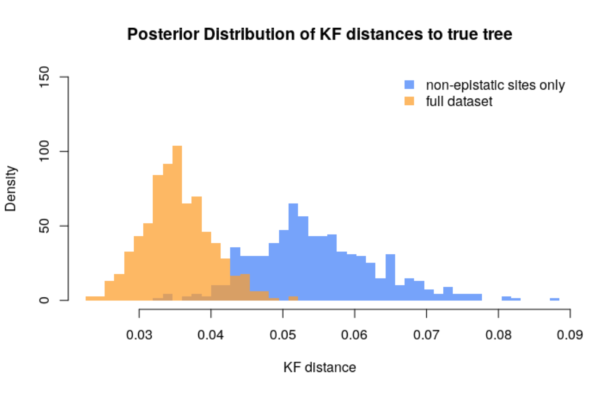
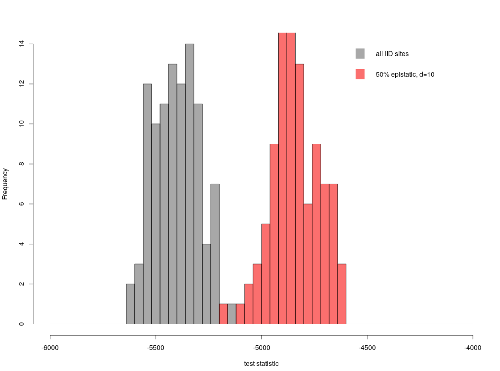
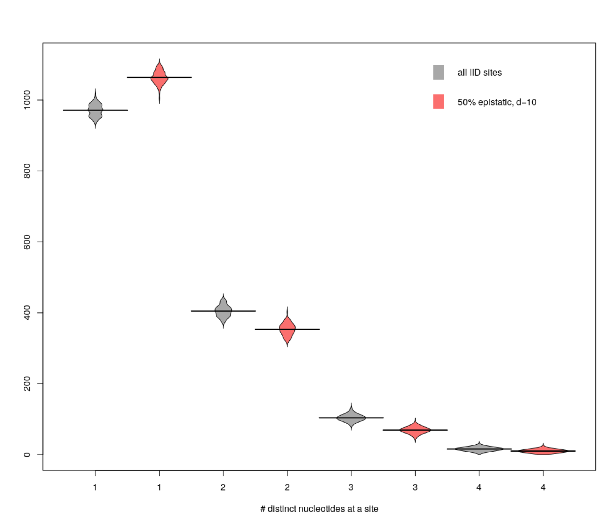
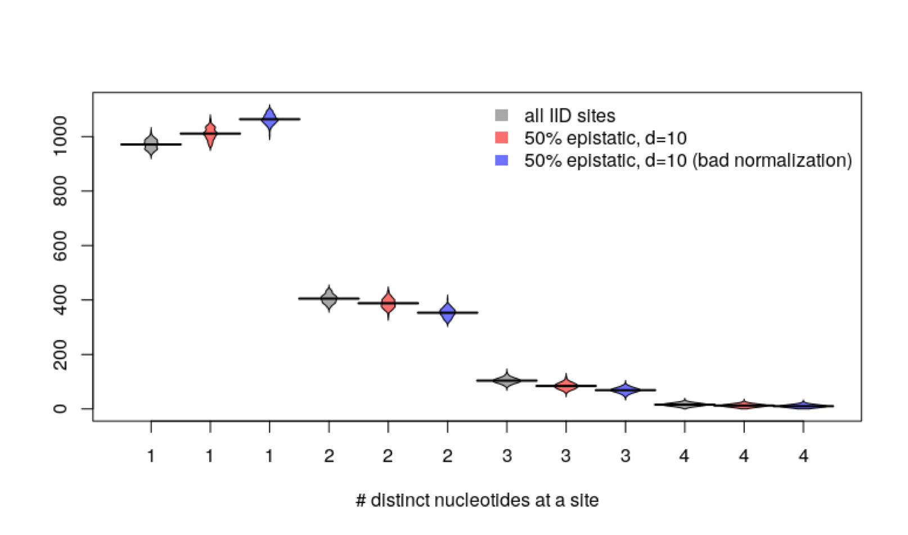

# First pass simulation results

SKH 20181116

## Goal and Background

We started the `phyload` project talking about the idea of and papers about model adequacy / posterior predictive checks.
We settled on the idea of epistasis because epistasis has been shown to be present in naturally evolving proteins/RNA, site-independent models do not take epistasis into account, and we thought we might be able to come up with ways to detect epistasis and the consequences of epistasis.

Andy presented "A Phylogenetic Model for the Detection of Epistatic Interactions" (Nasrallah, Huelsenbeck 2013) at phyloseminar and we decided to start with this model/RNA epistasis because it seems more tractable.

Andy implemented the model in `RevBayes` and simulated sequences varying both the strength of the epistatic interactions (d) and the number of sites in the alignment which are epistatic.
Below are the results of these simulations, our analysis, questions, and next steps.

## Model

We are using the model from "A Phylogenetic Model for the Detection of Epistatic Interactions" (Nasrallah, Huelsenbeck 2013).
More information about the model can be found in the [`./models.pdf`](./models.pdf) document.

## First simulation result

The first simulation test had 300 standard/independent sites and 200 paired/epistatic sites.

The plot is looking at the effect of having epistatic sites on the tree:  
  

The orange distribution is on the full set described above (500 sites, some of which are independent and some of which are paired).
The blue distribution is only on the independent sites (300 sites total).
This is the effect of saying "I can identify which sites are paired and I am going to discard them from my alignment."

To quote Andy on slack, "But still I think it could be good news, @wsdewitt may be able to tell the physicists to fuck off after all."
It looks like looking at only the independent sites results in trees which are further away from the true tree than an alignment with epistatic sites.
However, we noted that there are fewer independent sites than the full dataset.
Is this results just due to the number of sites?
Moving forward, we want to have a control which is 500 independent sites, which would hypothesize would be to the left of the orange distribution above.

## Scale-up the simulations

Once we knew that we could perform the simulations and get some interesting results, we came up with a laundry list of alignments we would like to look at.
These alignments having varying strengths of epistatic interactions(d) and proportion of paired sites.
We decided simulate flu (specifically seasonal human H1N1 HA) because we have a good handle on the tree shape and Sarah can very easily get and clean flu data.

The grid we simulated over is 3x4x5.   
* 3 analysis types: the shorter nonepestatic alignment, the full epistatic + nonepistatic sites, and the alignment equal in length to the full alignment but with no epistasis
* 4 values of proportion of epistatic sites: 0.25, 0.5, 0.75, 1
* 5 values of d: 0, 1, 2, 5, 10  

with n=1486 (number of nucleotide sites)

### Epistatic vs. independent with the multinomial test statistic

Can we tell if an alignment has epistasis? yes!

Here is the distribution of multinomial test statistic values for two of the simulation strategies.
Both the grey and the red simulations have n=1486.  

However, these plot does not address two things which will be critical moving forward:  
1. Is the tree distorted in some way?
2. Does the difference become more subtle when we re-infer with a site-independent model?

### Number of invariant sites

Here is a plot of the biochemical diversity of the alignments used in the analysis above:  

We noticed that the alignment with epistatic sites has more invariant sites than the iid alignment.
This was concerning because intuitively we thought the epistatic alignment should have more variant sites.
This lead to the discussion below about how the normalization of the Q matrix should go.

## New normalization scheme

We settled on a new normalization scheme where the probability of a single substitution is weighed by 0.5 and the probability of a double substitution is weighed by 1.

Now the plot looks like this:

Changing the normalization scheme reduced the number of invariant sites in the epistatic alignment but there are still more invariant sites in the epistatic alignment than in the iid alignment.

This mystery is not completely solved.

## Next steps

We outlined three major next steps and Will opened issues on Github to track them.

1. What's going on with the number of invariant sites?
2. What are some more test statistics we could use to identify alignments with epistasis?
3. How does this all affect tree inference?

## Possible stories for a paper

1. We can identify epistasis in a alignment using these test statistics (but not these other very common statistics).
2. If you find that your alignment has strong epistasis you should ... ditch those sites? keep them in?
3. Guess what physicists, phylogenetics works.  
